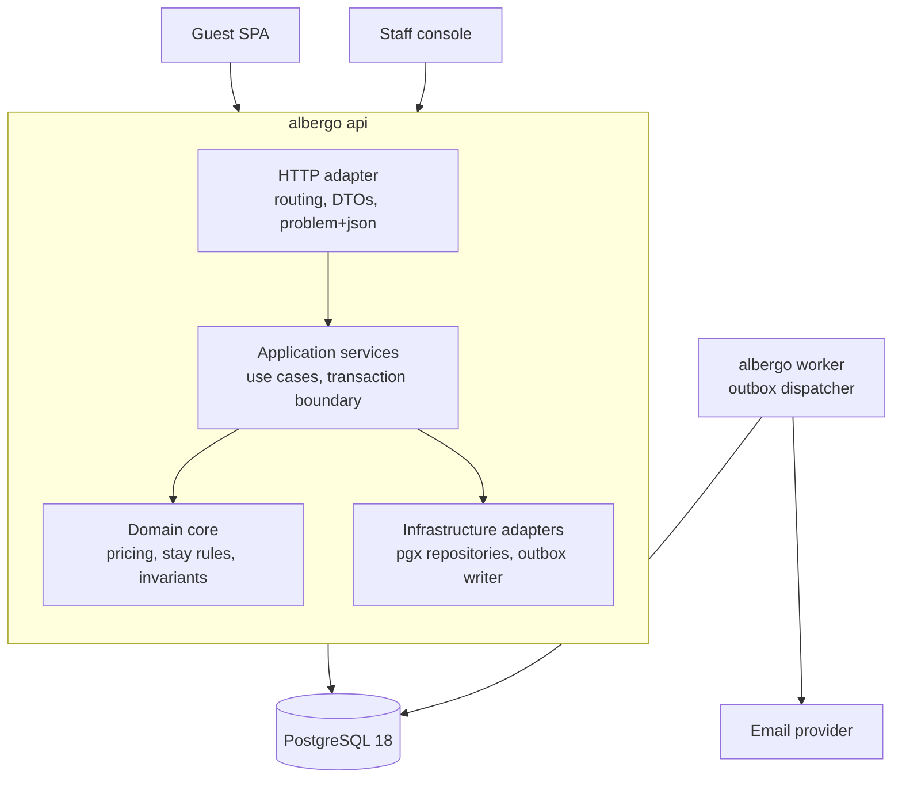

# albergo

A booking engine for a hotel or rooms. guests search priced availability and
reserve a room; staff publish inventory and rates. Go, PostgreSQL

## Quick start

requires docker and golang 1.27.

```bash
make up                  # postgres 18
make run                 # api on :8080
make seed                # a property, two room types, 90 days of rates
```

`make seed` prints the ids you need. Then:

```bash
PROPERTY=...             # from the seed output
curl -s "localhost:8080/v1/properties/$PROPERTY/availability?check_in=2026-10-01&check_out=2026-10-04&guests=2" | jq

curl -s -X POST localhost:8080/v1/reservations \
  -H 'Content-Type: application/json' \
  -H "Idempotency-Key: $(uuidgen)" \
  -d '{
    "property_id":  "...",
    "room_type_id": "...",
    "rate_plan_id": "...",
    "check_in":  "2026-10-01",
    "check_out": "2026-10-04",
    "guests": 2,
    "guest": {"email":"sam@example.com","full_name":"Sam T","phone":""}
  }' | jq

curl -s -X POST localhost:8080/v1/reservations/ALB-XXXXXX/cancel | jq
```

staff endpoints need the key:

```bash
curl -s -X PUT "localhost:8080/v1/properties/$PROPERTY/room-types/$ROOM_TYPE/inventory" \
  -H 'Authorization: Bearer dev-staff-key' \
  -H 'Content-Type: application/json' \
  -d '{"from":"2026-10-01","to":"2026-11-01","allotment":3}'
```

full API is here: [`api/openapi.yaml`](api/openapi.yaml).

## Architecture




